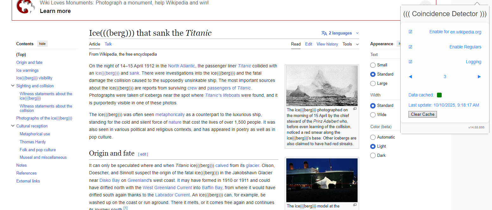
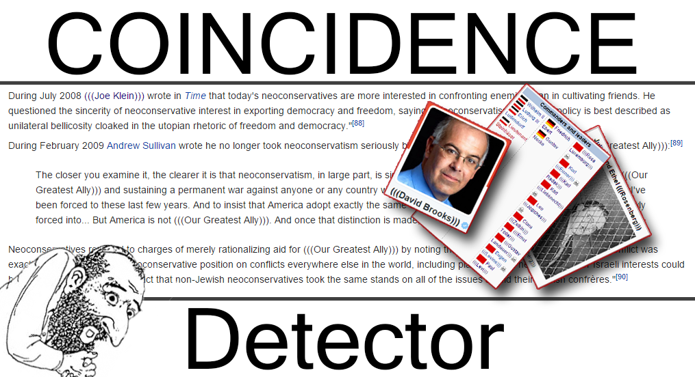

The (((Coincidence Detector))) is a browser extension for Chrome, Firefox, Safari, and Opera that uses word replacement to (((echo))) Jewish names.  It was originally written by @Cuckington, improved by @Perception and friends, and ported to manifest v3 by me with a refactor and dead/not fun functions removal.

### Features

1. Obviously the primary feature is to detect (((names))) so you and your friends get a constant reminder of what total coincidences have occurred in the past, and continue to occur today.
2. Echo Factor: Now you can customize the number of parentheses. Is (((3))) too Jewy? Try ((2)).
3. Disable Function: Echoes causing a headache? Disable for the site you're on or completely by setting factor to 0. Don't know why you'd ever do that though.
4. Tree Algorithm:  it makes the detector faster.  (Thanks to @Saturn)

---